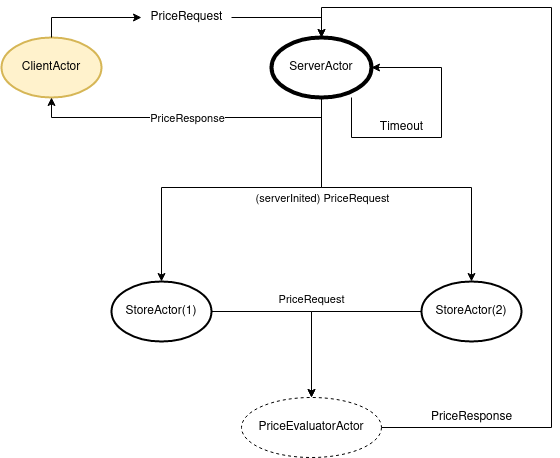
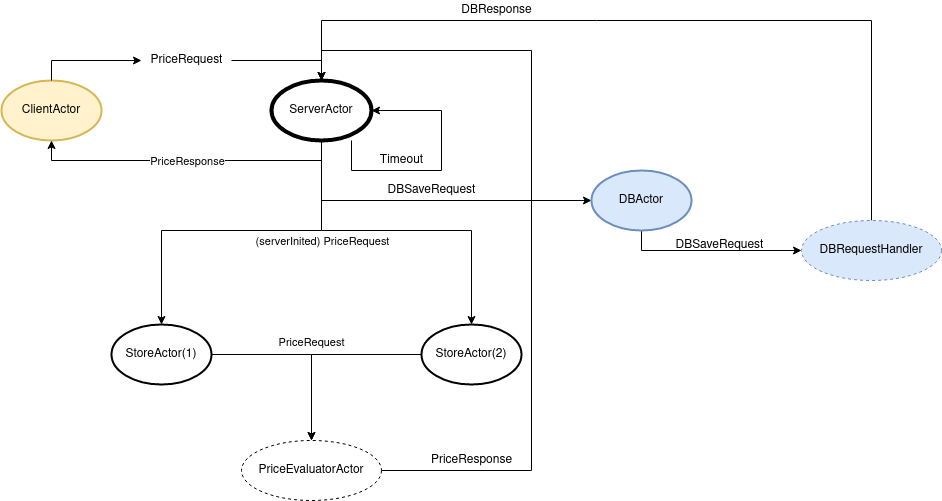
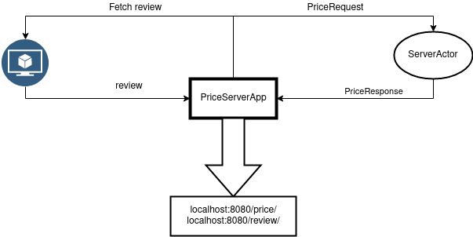

# Part1
1. Run `App`
2. Write random strings to get a price for them

# Part2
1. Run `App`
2. Write random strings to get a price for them

# Part3
Run `PriceServerApp`

* To check the price go to `localhost:8080/price/<product name>`
* To check the review go to `localhost:8080/review/<product name>`

